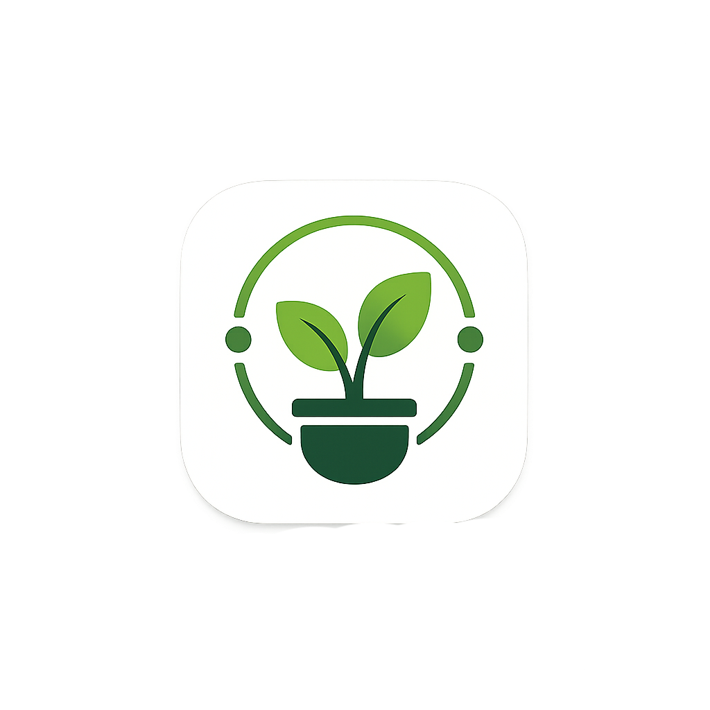

# 🌿 Green Sync – Your Virtual Garden Companion 🌸

<p align="center">
  
</p>

<p align="center">
  <strong>Grow, organize, and manage your digital garden with real-time weather support.</strong>
</p>

<p align="center">
  
  
  
  
</p>

---

## 🌱 About the App

**Green Sync** is a Flutter application that helps you create and manage a **virtual garden** in a simple and interactive way.

You can add plants, organize them, and view real-time weather information to better understand your environment.

---

## ✨ Features

### 🌼 Virtual Garden
Create and manage your own digital garden space.

### 🌿 Plant Management
- ➕ Add plants  
- ✏️ Edit plant details  
- ❌ Remove plants  
- 📋 Organize your collection  

### 🌦️ Weather Integration
Get real-time weather updates for your location to stay connected with your environment.

### 💾 Local Storage
All data is stored locally using **Hive**, ensuring fast and offline access.

### 🎨 Clean UI
Simple and modern interface designed for smooth user experience.

---

## 🛠️ Built With

| Technology | Purpose |
|------------|---------|
| 💙 Flutter | App framework |
| 🎯 Dart | Programming language |
| 📦 Hive | Local database |
| ☁️ OpenWeather API | Weather data |
| 🎨 Adobe Photoshop | UI assets |
| 💻 Visual Studio Code | Development |

---

## 🚀 Getting Started

### Prerequisites

- Flutter SDK installed  
- Android Studio or VS Code  
- Emulator or physical device  

Flutter install guide:  
https://docs.flutter.dev/get-started/install  

---

## 📥 Installation

### 1. Clone the repository
```bash
git clone https://github.com/your-username/green-sync.git
```

### 2. Navigate to project
```bash
cd green-sync
```

### 3. Install dependencies
```bash
flutter pub get
```

### 4. Run the app
```bash
flutter run
```

---

<p align="center">

### 🌿 Grow your digital garden, one plant at a time 🌸

</p>